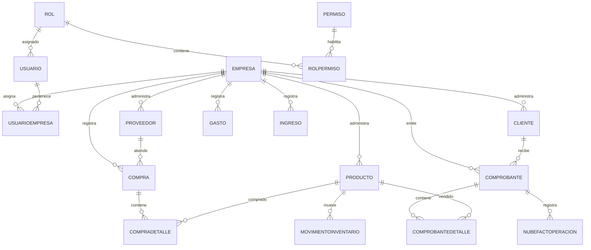
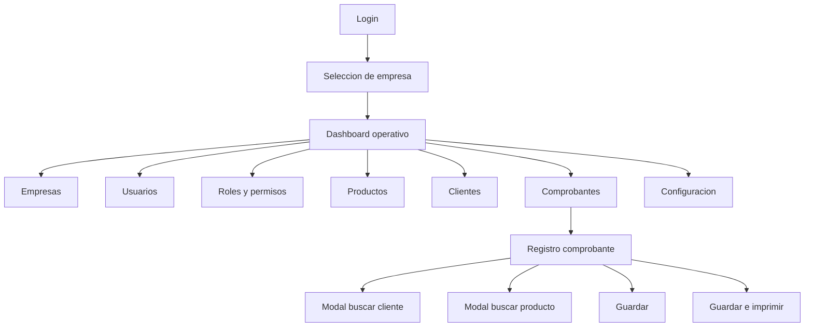

# Arquitectura propuesta - ViveroLosFrutales

## 1. Alcance

ViveroLosFrutales sera un sistema web empresarial multiempresa para gestion comercial de viveros. Cubrira empresas, usuarios, roles, permisos, productos, clientes, proveedores, compras, cotizaciones, comprobantes, gastos, ingresos, reportes, facturacion electronica con Nubefact, documentos PDF locales y configuracion general.

La primera version se optimizara para un maximo aproximado de 3 usuarios concurrentes, hosting Windows compartido y SQL Server, priorizando bajo consumo de recursos, mantenibilidad y operacion eficiente en escritorio.

## 2. Decisiones base

| Area | Decision propuesta |
| --- | --- |
| Tipo de arquitectura | Monolito modular con Clean Architecture simplificada |
| Framework | ASP.NET Core 8 MVC |
| Lenguaje | C# |
| Persistencia | Entity Framework Core + SQL Server |
| Seguridad | ASP.NET Identity adaptado a multiempresa y permisos |
| Frontend | Razor Views, Bootstrap 5, jQuery, DataTables, Select2, SweetAlert2 |
| PDF local | QuestPDF |
| Facturacion electronica | Nubefact API |
| Logging | Serilog |
| Base de datos | ViveroLosFrutalesDB |
| Connection string | ViveroLosFrutalesConnection |
| Moneda inicial | PEN, simbolo S/ |

## 3. Punto de decision pendiente

La especificacion menciona dos nombres de estructura:

- Nombre de solucion: `ViveroLosFrutales.sln`
- Proyectos esperados: `ViveroLosFrutales.Web`, `ViveroLosFrutales.Application`, `ViveroLosFrutales.Domain`, `ViveroLosFrutales.Infrastructure`
- En la seccion de arquitectura aparece `ViveroFULL.Web`, `ViveroFULL.Application`, `ViveroFULL.Domain`, `ViveroFULL.Infrastructure`

Decision recomendada: usar `ViveroLosFrutales` en toda la solucion, proyectos, namespaces y base de datos para mantener consistencia con el nombre comercial.

## 4. Estructura de solucion

```text
ViveroLosFrutales.sln

src/
  ViveroLosFrutales.Web/
    Controllers/
    Views/
    ViewModels/
    Filters/
    Middleware/
    TagHelpers/
    wwwroot/
    appsettings.json
    Program.cs

  ViveroLosFrutales.Application/
    Common/
    DTOs/
    Interfaces/
    Services/
    Validators/
    Security/
    Mapping/

  ViveroLosFrutales.Domain/
    Common/
    Entities/
    Enums/
    ValueObjects/
    Rules/

  ViveroLosFrutales.Infrastructure/
    Data/
    Identity/
    Repositories/
    Services/
    Nubefact/
    Pdf/
    Logging/
    Migrations/

tests/
  ViveroLosFrutales.Tests/
```

## 5. Responsabilidades por capa

### ViveroLosFrutales.Web

Capa MVC responsable de la interaccion con el usuario.

- Controladores MVC.
- Vistas Razor.
- ViewModels especificos de pantalla.
- Validaciones de entrada orientadas a UI.
- Filtros de autenticacion, empresa activa y permisos.
- Configuracion de Bootstrap, DataTables, Select2 y SweetAlert2.
- Manejo de sesion de empresa seleccionada.

No debe contener logica de negocio compleja ni acceso directo a `DbContext`.

### ViveroLosFrutales.Application

Capa de casos de uso y servicios de aplicacion.

- DTOs de entrada y salida.
- Servicios por modulo.
- Interfaces de repositorios y servicios externos.
- Validaciones de negocio.
- Orquestacion de flujos: emitir comprobante, generar PDF, convertir cotizacion, anular documentos.
- Reglas multiempresa.
- Proyecciones optimizadas para listados.

No debe depender de EF Core, SQL Server, Nubefact ni QuestPDF directamente.

### ViveroLosFrutales.Domain

Capa de dominio.

- Entidades principales.
- Enums de tipos y estados.
- Reglas puras del negocio.
- Constantes de dominio.
- Contratos base de auditoria y multiempresa.

Debe mantenerse sin dependencias de infraestructura.

### ViveroLosFrutales.Infrastructure

Capa de persistencia e integraciones.

- `ApplicationDbContext`.
- Configuraciones EF Core.
- Migraciones.
- Repositorios.
- Implementacion de Identity.
- Cliente Nubefact.
- Generacion PDF con QuestPDF.
- Implementacion de logging tecnico.
- Servicios de fecha, usuario actual y archivos.

## 6. Modulos funcionales

| Modulo | Responsabilidad |
| --- | --- |
| Empresas | Registro y mantenimiento de empresas, series, credenciales Nubefact y moneda predeterminada |
| Usuarios | Gestion de usuarios, asignacion a empresas y restablecimiento de contrasena |
| Roles y permisos | Roles del sistema y permisos configurables por modulo/accion |
| Productos | Catalogo, stock, precios, IGV y detraccion |
| Clientes | Registro, validacion documental y busqueda rapida |
| Proveedores | Registro y mantenimiento de proveedores por empresa |
| Compras | Registro de compras, detalle de productos y aumento automatico de stock |
| Inventario | Movimientos por compra, venta y ajuste |
| Comprobantes | Entidad para BOL, FAC y NCR; NPE queda solo como compatibilidad historica |
| Cotizaciones | Documento no SUNAT, PDF local y conversion solo a nota de pedido |
| Boletas | Emision electronica mediante Nubefact |
| Facturas | Emision electronica mediante Nubefact |
| Notas de pedido | Documento interno con PDF local |
| Gastos | Registro financiero de egresos operativos |
| Ingresos | Registro financiero de ingresos no asociados a comprobantes |
| Reportes | Consultas con rango de fecha y exportacion futura |
| Configuracion | Parametros generales, moneda, series y datos operativos |

## 7. Modelo de dominio

### Entidades principales

- `Empresa`
- `ApplicationUser` o `Usuario`
- `Rol`
- `Permiso`
- `RolPermiso`
- `UsuarioEmpresa`
- `Producto`
- `Cliente`
- `Proveedor`
- `Compra`
- `CompraDetalle`
- `MovimientoInventario`
- `Gasto`
- `Ingreso`
- `Comprobante`
- `ComprobanteDetalle`
- `Moneda`
- `NubefactOperacion`
- `ConfiguracionEmpresa`

### Contratos comunes

Las entidades transaccionales deben incluir:

- `EmpresaId`
- `FechaRegistro`
- `UsuarioRegistro`
- `Estado`

Entidades recomendadas con multiempresa obligatorio:

- `Producto`
- `Cliente`
- `Comprobante`
- `Proveedor`
- `Compra`
- `MovimientoInventario`
- `Gasto`
- `Ingreso`
- `ConfiguracionEmpresa`
- `NubefactOperacion`

`Empresa`, `Rol`, `Permiso`, `Moneda` y usuarios pueden ser globales, con relaciones especificas para acceso multiempresa.

## 8. Enums recomendados

```csharp
TipoComprobante: COT, BOL, FAC, NPE (compatibilidad), NCR
EstadoRegistro: Activo, Anulado
EstadoSunat: NoAplica, Pendiente, Aceptado, Observado, Rechazado, Anulado
FormaPago: Contado, Credito
TipoDocumentoCliente: DNI, RUC, CE, Otro
TipoMovimientoInventario: COMPRA, VENTA, AJUSTE
TipoPermiso: Ver, Crear, Editar, Anular, Imprimir, Configurar
```

## 9. Modelo de base de datos

### Tablas

```text
Empresa
  EmpresaId PK
  RUC
  RazonSocial
  NombreComercial
  Direccion
  Telefono
  Email
  MonedaPredeterminada
  UrlNubefact
  TokenNubefact
  SerieBoleta
  SerieFactura
  SerieNotaPedido
  SerieCotizacion
  Estado

Rol
  RolId PK
  Nombre
  Descripcion
  Estado

Permiso
  PermisoId PK
  Modulo
  Accion
  Descripcion
  Estado

RolPermiso
  RolPermisoId PK
  RolId FK
  PermisoId FK

Usuario
  UsuarioId PK
  Nombres
  Apellidos
  Correo
  Usuario
  PasswordHash
  RolId FK
  Estado

UsuarioEmpresa
  UsuarioEmpresaId PK
  UsuarioId FK
  EmpresaId FK

Producto
  ProductoId PK
  EmpresaId FK
  Categoria
  Nombre
  UnidadMedida
  Stock decimal(18,2)
  AfectoIgv bit
  PrecioVentaSinIgv decimal(18,2)
  PrecioVentaConIgv decimal(18,2)
  TieneDetraccion bit
  PorcentajeDetraccion decimal(5,2)
  FechaRegistro
  UsuarioRegistro
  Estado

Cliente
  ClienteId PK
  EmpresaId FK
  TipoDocumento
  NumeroDocumento
  NombreCompleto
  Email
  Direccion
  Telefono
  FechaRegistro
  UsuarioRegistro
  Estado

Proveedor
  ProveedorId PK
  EmpresaId FK
  TipoDocumento
  NumeroDocumento
  RazonSocial
  NombreComercial
  Direccion
  Telefono
  Email
  FechaRegistro
  UsuarioRegistro
  Estado

Compra
  CompraId PK
  EmpresaId FK
  ProveedorId FK
  Documento
  Fecha
  SubTotal decimal(18,2)
  Igv decimal(18,2)
  Total decimal(18,2)
  FechaRegistro
  UsuarioRegistro
  Estado

CompraDetalle
  CompraDetalleId PK
  CompraId FK
  ProductoId FK
  Cantidad decimal(18,2)
  CostoUnitario decimal(18,2)
  Importe decimal(18,2)

MovimientoInventario
  MovimientoInventarioId PK
  EmpresaId FK
  ProductoId FK
  Tipo
  Fecha
  Cantidad decimal(18,2)
  StockAnterior decimal(18,2)
  StockNuevo decimal(18,2)
  Referencia
  FechaRegistro
  UsuarioRegistro
  Estado

Gasto
  GastoId PK
  EmpresaId FK
  Fecha
  Categoria
  Descripcion
  Importe decimal(18,2)
  MedioPago
  Observacion
  FechaRegistro
  UsuarioRegistro
  Estado

Ingreso
  IngresoId PK
  EmpresaId FK
  Fecha
  TipoIngreso
  Descripcion
  Importe decimal(18,2)
  Observacion
  FechaRegistro
  UsuarioRegistro
  Estado

Comprobante
  ComprobanteId PK
  EmpresaId FK
  TipoComprobante
  Serie
  Correlativo
  ClienteId FK
  FechaEmision
  FormaPago
  SubTotal decimal(18,2)
  Igv decimal(18,2)
  Total decimal(18,2)
  MontoDetraccion decimal(18,2)
  EstadoSunat
  Estado
  PdfUrl
  XmlUrl
  NubefactHash
  NubefactRespuesta
  FechaRegistro
  UsuarioRegistro

ComprobanteDetalle
  ComprobanteDetalleId PK
  ComprobanteId FK
  ProductoId FK
  Cantidad decimal(18,2)
  PrecioUnitario decimal(18,2)
  Importe decimal(18,2)

Moneda
  MonedaId PK
  Codigo
  Descripcion
  Simbolo
  Estado

NubefactOperacion
  NubefactOperacionId PK
  EmpresaId FK
  ComprobanteId FK
  TipoOperacion
  EstadoSunat
  PdfUrl
  XmlUrl
  Hash
  RespuestaCompleta
  FechaRegistro
  UsuarioRegistro
```

### Indices recomendados

```text
IX_Producto_EmpresaId
IX_Producto_EmpresaId_Nombre
IX_Cliente_EmpresaId
IX_Cliente_EmpresaId_NumeroDocumento
IX_Cliente_EmpresaId_NombreCompleto
IX_Proveedor_EmpresaId
IX_Proveedor_EmpresaId_NumeroDocumento
IX_Proveedor_EmpresaId_RazonSocial
IX_Compra_EmpresaId
IX_Compra_EmpresaId_Fecha
IX_Compra_EmpresaId_ProveedorId
IX_MovimientoInventario_EmpresaId
IX_MovimientoInventario_EmpresaId_ProductoId_Fecha
IX_Gasto_EmpresaId
IX_Gasto_EmpresaId_Fecha
IX_Ingreso_EmpresaId
IX_Ingreso_EmpresaId_Fecha
IX_Comprobante_EmpresaId
IX_Comprobante_EmpresaId_TipoComprobante
IX_Comprobante_EmpresaId_Serie_Correlativo
IX_Comprobante_EmpresaId_FechaEmision
IX_Comprobante_EmpresaId_EstadoSunat
IX_UsuarioEmpresa_UsuarioId_EmpresaId
```

Indice unico recomendado:

```text
UX_Comprobante_EmpresaId_TipoComprobante_Serie_Correlativo
```

## 10. Relaciones principales



## 11. Estrategia multiempresa

1. El usuario inicia sesion con Identity.
2. El sistema consulta las empresas activas asociadas en `UsuarioEmpresa`.
3. Si tiene una sola empresa, se selecciona automaticamente.
4. Si tiene varias, se muestra pantalla de seleccion de empresa.
5. La empresa activa se guarda en sesion o claim temporal.
6. Toda consulta transaccional filtra por `EmpresaId`.
7. Todo registro nuevo transaccional asigna `EmpresaId` desde la empresa activa.
8. Los servicios de aplicacion validan permiso + empresa antes de ejecutar operaciones.

Regla estricta: ningun controlador debe recibir `EmpresaId` confiando en el formulario para operaciones transaccionales. El `EmpresaId` debe salir del contexto de usuario/empresa activa.

## 12. Seguridad y permisos

### Roles iniciales

Administrador:

- Acceso total.

Vendedor:

- Productos.
- Clientes.
- Cotizaciones.
- Comprobantes.

### Validaciones obligatorias

Cada accion protegida debe validar:

- Usuario autenticado.
- Empresa activa seleccionada.
- Usuario asignado a la empresa activa.
- Rol activo.
- Permiso activo para modulo y accion.

### Permisos por modulo

Modulos base:

- Empresas.
- Usuarios.
- Roles.
- Productos.
- Clientes.
- Cotizaciones.
- Comprobantes.
- Proveedores.
- Compras.
- Gastos.
- Ingresos.
- Reportes.
- Configuracion.

Acciones base:

- Ver.
- Crear.
- Editar.
- Anular.
- Imprimir.
- Configurar.

## 13. Servicios de aplicacion

```text
IEmpresaService
IUsuarioService
IRolService
IPermisoService
IProductoService
IClienteService
IProveedorService
ICompraService
IGastoService
IIngresoService
IComprobanteService
ICotizacionService
INubefactService
IPdfService
IMonedaService
IEmpresaContextService
IPermissionService
ICorrelativoService
```

### Repositorios

Para evitar sobreingenieria, se recomienda repositorio por agregado/modulo, no un repositorio generico obligatorio para todo.

```text
IEmpresaRepository
IProductoRepository
IClienteRepository
IProveedorRepository
ICompraRepository
IGastoRepository
IIngresoRepository
IComprobanteRepository
IUsuarioEmpresaRepository
```

Las consultas de lectura para grillas pueden resolverse con metodos especificos que devuelvan DTOs paginados.

## 14. DTOs principales

```text
EmpresaListDto
EmpresaEditDto
UsuarioListDto
UsuarioEditDto
RolEditDto
PermisoDto
ProductoListDto
ProductoEditDto
ClienteListDto
ClienteEditDto
ProveedorListDto
ProveedorEditDto
CompraListDto
CompraEditDto
CompraDetalleEditDto
GastoListDto
GastoEditDto
IngresoListDto
IngresoEditDto
ComprobanteListDto
ComprobanteEditDto
ComprobanteDetalleDto
ComprobanteTotalesDto
NubefactResponseDto
PagedResultDto<T>
DataTableRequestDto
```

## 15. Flujo de navegacion



## 16. Flujo de comprobantes

### Guardar

1. Validar usuario, empresa activa y permisos.
2. Validar cliente.
3. Validar productos y stock.
4. Calcular subtotal, IGV, total y detraccion.
5. Obtener serie y correlativo.
6. Registrar `Comprobante` y `ComprobanteDetalle`.
7. Dejar `EstadoSunat` segun tipo:
   - COT: NoAplica.
   - NPE: NoAplica, solo compatibilidad historica.
   - NCR: envio electronico como nota de credito.
   - BOL/FAC: Pendiente.

### Guardar e imprimir

Para BOL/FAC:

1. Registrar comprobante.
2. Enviar a Nubefact.
3. Guardar estado SUNAT, XML, PDF, hash y respuesta completa.
4. Mostrar PDF Nubefact.

Para COT/NPE historico:

1. Registrar comprobante.
2. Generar PDF local.
3. Guardar URL o ruta del PDF.
4. Mostrar PDF.

No se implementara accion separada "Guardar y enviar a Nubefact".

## 17. Integracion Nubefact

### Interfaz

```text
INubefactService
  EmitirComprobanteAsync(...)
  ConsultarEstadoAsync(...)
  AnularComprobanteAsync(...)
```

### Datos a persistir

- Estado SUNAT.
- XML.
- PDF.
- Hash.
- Respuesta completa.
- Fecha de operacion.
- Usuario que ejecuto la operacion.

### Consideraciones

- Las credenciales Nubefact son por empresa.
- La URL y token se obtienen desde `Empresa`.
- Serilog debe registrar errores e integraciones criticas sin exponer tokens.
- Si Nubefact falla despues de registrar el comprobante, el documento queda como `Pendiente` y con respuesta/error registrado.

## 18. PDF local

PDF local aplica para:

- Cotizacion.
- Nota de pedido.

Se generara con QuestPDF y se guardara en una carpeta controlada por empresa y tipo de documento.

Ruta sugerida:

```text
wwwroot/documentos/{empresaId}/{tipoComprobante}/{serie}-{correlativo}.pdf
```

En hosting compartido se debe validar que la carpeta tenga permisos de escritura.

## 19. UX/UI empresarial

Principios:

- Priorizar eficiencia operativa sobre decoracion.
- Usar todo el ancho disponible.
- Evitar tarjetas gigantes y margenes excesivos.
- Mantener formularios compactos de multiples columnas.
- Optimizar escritorio: 1366x768, 1920x1080, 2560x1440.

### Layout base

- Menu lateral colapsable.
- Header compacto con empresa activa y usuario.
- Area principal fluida.
- Tablas densas con DataTables.
- Formularios con secciones horizontales.

### Formulario comprobante

Debe mostrar en una sola pantalla:

- Datos cliente.
- Datos comprobante.
- Forma de pago.
- Detalle de productos.
- Totales.

Modales:

- Buscar cliente.
- Buscar producto.
- Confirmaciones.

## 20. Rendimiento

Reglas obligatorias:

- No usar `SELECT *`.
- Usar DTOs para lectura.
- Usar `Select()` con proyecciones.
- Usar `AsNoTracking()` en consultas de solo lectura.
- Evitar lazy loading innecesario.
- Evitar consultas dentro de `foreach`.
- Evitar N+1.
- Implementar paginacion, ordenamiento, busqueda y filtros.

Para grillas:

- DataTables server-side cuando el volumen pueda crecer.
- Listados con 20 a 30 filas visibles cuando sea posible.
- Consultas filtradas por `EmpresaId`.

## 21. Logging

Serilog registrara:

- Errores.
- Excepciones.
- Operaciones criticas.
- Emisiones Nubefact.
- Anulaciones.
- Fallos de seguridad o permisos.

Destino inicial recomendado:

- Archivo local rotativo.
- Tabla SQL opcional si el hosting lo permite sin afectar rendimiento.

## 22. Migraciones y SQL Server

La base se creara con EF Core Migrations.

Adicionalmente se generaran scripts SQL Server para:

- Creacion inicial.
- Indices.
- Datos maestros minimos:
  - Moneda PEN.
  - Roles Administrador y Vendedor.
  - Permisos base.

No se cargaran datos ficticios innecesarios.

## 23. Plan de implementacion sugerido

1. Crear solucion y proyectos.
2. Configurar referencias entre capas.
3. Configurar ASP.NET Identity, EF Core, SQL Server y Serilog.
4. Crear entidades, enums y configuraciones EF.
5. Crear migracion inicial.
6. Implementar multiempresa y seleccion de empresa.
7. Implementar roles y permisos.
8. Implementar empresas, usuarios, productos y clientes.
9. Implementar comprobantes como entidad unica.
10. Implementar PDF local.
11. Implementar Nubefact.
12. Implementar vistas Razor finales.
13. Agregar pruebas focalizadas de reglas criticas.
14. Preparar despliegue en hosting Windows compartido.

## 24. Riesgos y decisiones a validar

| Tema | Riesgo | Decision recomendada |
| --- | --- | --- |
| Nombres `ViveroFULL` vs `ViveroLosFrutales` | Inconsistencia de namespaces y carpetas | Usar solo `ViveroLosFrutales` |
| Identity con tabla `Usuario` propia | Duplicidad con ASP.NET Identity | Extender `IdentityUser` con campos de negocio |
| Token Nubefact en empresa | Dato sensible en BD | Guardar protegido cuando sea posible y nunca mostrar completo en UI |
| Hosting compartido | Restricciones de escritura y procesos | PDF en `wwwroot/documentos` o carpeta permitida |
| Correlativos | Duplicidad en concurrencia | Control transaccional e indice unico por empresa/tipo/serie/correlativo |
| Stock | Descuentos inconsistentes | Validar y actualizar dentro de transaccion |
| Facturacion electronica | Falla Nubefact despues de guardar | Estado Pendiente + log + respuesta completa |

## 25. Aprobacion requerida antes de codigo

Antes de generar codigo se recomienda aprobar:

1. Usar `ViveroLosFrutales` como nombre unico de solucion, proyectos y namespaces.
2. Extender ASP.NET Identity en lugar de crear autenticacion manual.
3. Mantener `Comprobante` como entidad unica para cotizaciones, boletas, facturas y notas de pedido.
4. Usar QuestPDF para documentos locales.
5. Usar DataTables server-side para grillas principales.
6. Guardar credenciales Nubefact por empresa.
7. Implementar permisos por modulo y accion.
